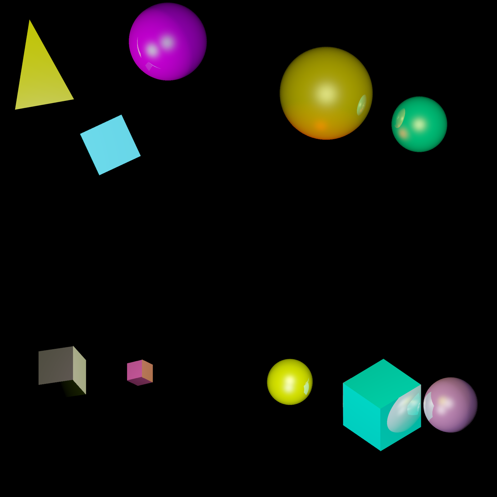

# IN204 - IT Project w/ Axel Dumont - RayTracer



## Résumé

Ce projet effectue un RayTracing sur un environnement composé de **sphères** et de **cubes**.

 - L'ensemble du code se trouve dans le dossier _src_.

 - Les scènes (objets, matériaux des objets, lumières) sont au format.txt et sont dans le dossier _scenes_.
 
 - Les images résultantes s'affichent en .png dans le dossier _images_.


## Compilation

### Packages nécessaires

Ces 2 packages sont nécessaires à la compilation :
​
```bash
sudo apt install graphicsmagick-imagemagick-compat
sudo apt install eog
```
Pour ne pas avoir de warning en utilisant le package eog, il faut installer ce package:

```bash
sudo apt install adwaita-icon-theme-full
```

### Ligne de commande

Pour compiler le projet, il faut taper la commande `make all`. 

Pour nettoyer les fichiers images et l'éxécutable, il faut utiliser `make clean`.

Il est également possible de générer seulement une certaine image. Pour l'image 1 par exemple, il y a la commande `make image1`.

## Description du système de scène 
​ 
Les scènes sont définies en **.txt** selon le format suivant :

*  _taille de l'image : Longeur Hauteur_ 
* _nombre de matériaux, nombre d'objets, nombre de lumières_
* _premier matériau: pourcentage rouge vert bleu et coefficient de reflexion_
* _deuxieme materiel s'il existe_
* _troisieme materiel s'il existe et etc..._ 
* _objet 1: posx, posy, posz, rayon (ou taille des côtés pour un cube), id du matériel (selon leur ordre dans le .txt), type de l'objet (cube ou sphère) angle_rot_x, angle_rot_y (à mettre en degrés)
*  _objet 2_ s'il existe
* _objet 3_ s'il existe et etc...
* _lumière 1 : posx, posy, posz, intensité rouge, vert et bleu_
* _lumière 2 si elle existe_

### Exemple de la première scène :
​
**scene1.txt :**
```txt
640 480                            
3 3 2                             
1.0 1.0 0.0 0.5                    
0.0 1.0 1.0 0.5                   
1.0 0.0 1.0 0.5                   
233.0 290.0 0.0 100 0 sphere 0    
407.0 290.0 0.0 100 1 sphere 0   
320.0 140.0 0.0 100 2 sphere 0     
0.0 240.0 -100.0 1.0 1.0 1.0 
640.0 240.0 -10000.0 0.6 0.7 1.0
```

## Fonctionnement de l'algorithme

1. Nous commencons par lire le fichier texte et placer les informations de la scène dans 3 listes (fonction `init()` de _main.cpp_ ) :
    - Les informations de chaque matériau sont dans la matrice matTab : **matTab[i]** contient les infos sur le matériau d'indice _i_.
    - Les informations de chaque objet sont dans la matrice objTab : **objTab[i]** contient les infos sur l'objet d'indice _i_.
    - Les informations de chaque lumière sont dans la matrice lgtTab : **lgtTab[i]** contient les infos sur la lumière d'indice _i_.

2. On construit une image au format **TGA** (fonction `header_tga()` de _tga_image.hpp_ ) :
    - Les premiers octets de du fichier sont écrits de facon bien spécifique pour que le fichier soit considéré comme un .tga.
    - Ensuite, chaque groupe de 3 octets décrit les valeurs RBG d'un pixel.
    - Les pixels sont coloriés **ligne par ligne, de gauche à droite, en partant de la ligne du bas**.
    - Dans notre algorithme, on parcourt donc pour chaque y, tous les x, en partant de (x,y) = (0,0) (_lignes 28-29 de raytracer.cpp_)

3. Pour "parcourir" les pixels, on envoie un rayon horizontal d'origine (x,y). 
    - Si ce rayon touche un objet, alors on note le pixel (x,y) comme faisant partie de l'objet de plus proche que le rayon a traversé.
    - Pour tester l'intersection rayon-objet, on utilise les fonctions `hitSphere()` et `hitCube()`.
    - Selon le type d'objet trouvé, on calcule le vecteur normal à la surface dont le pixel actue fait partie.
    - On fait alors partir un rayon depuis cette surface jusqu'à chaque source lumineuse une par une.

4. Pour "colorier" les pixels, on utilise la technique de ...
    - A completer mais flemme pour l'instant
